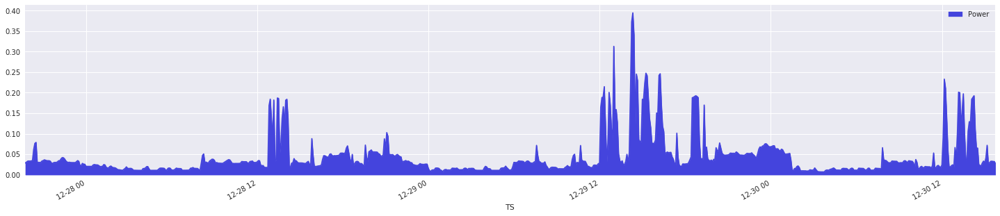
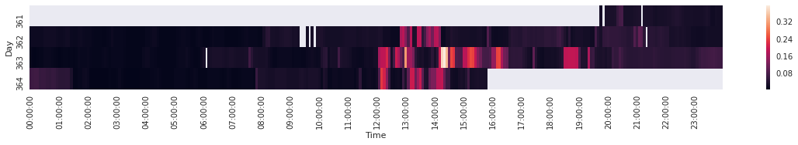
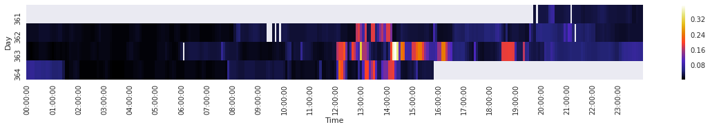
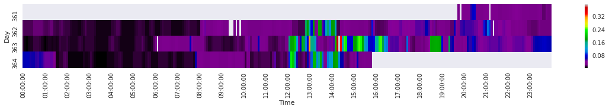
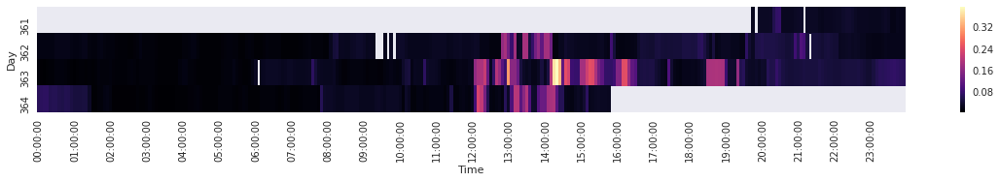
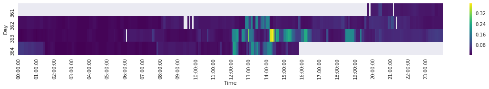

Evaluation Approach of Time Series Data containing High Resolution Household Power Consumption
===

Stefan Koch, 2019-12-29

The used raw data is from my house and is measured using the SMLogger project. The sensor data is continously stored in Postgresql DB time series table.


```python
import psycopg2
import pandas as pd
import matplotlib.pyplot as plt
import seaborn as sns
import json
```

# Create DB Connection

### Load config file for settings and secret


```python
with open("config.jsn") as json_file:
            cfg = json.load(json_file)
```

### Connect


```python
db = psycopg2.connect(user=cfg['user'], password=cfg['password'], 
                      host=cfg['host'], port=cfg['port'], 
                      database=cfg['database'])
```

# Get Data from DB

### Create our dataframe


```python
df = pd.DataFrame (columns = ['TS', 'Power' ])
```

### Fill raw data from DB into dataframe
and set timestamp as index column


```python
pcursor = db.cursor()
pcursor.execute('SELECT "ID","ts","kwh" FROM "public"."kwh_timeseries";')

index = 0
while True:
    row = pcursor.fetchone()
    if row is None:
        break
    df.loc[index] = [ pd.to_datetime(row[1]), row[2]]
    index += 1
df.set_index('TS', inplace=True)
print("Loaded %d measurements" % index)
```

    Loaded 812 measurements


### Bin the data samples
We will use a Seaborn heatmap for the 2d matrix display. For a matrix display we need to map the time samples to a bin set. I choose 5 minute bins by which the data sampled in average.

TODO explain the mean function
TODO consider resampling


```python
# we bin the TS column at 300s steps
dfbnd = df.groupby(pd.Grouper(level='TS', freq='300s')).mean()
npre  = dfbnd.shape[0]

# now drop any NaNs
dfbnd.dropna(inplace=True)
nafter = dfbnd.shape[0]
print("Stripped %d rows" % (npre-nafter))

# Get a quick visualization on linear time scale

```python
dfbnd.plot.area(figsize=(25,5), color='#4444dd')
```




The heatmap matrix shall have these axes:
   * Y: day number, labelled with date of Monday
   * X: hour
   * value shall be a colormap
   
Now lets add a new column based on day of year and check


```python
dfbnd['Day'] = dfbnd.index.dayofyear
dfbnd['Time'] = pd.to_datetime(dfbnd.index).time
dfbnd.head(10)
```


<div>
<style scoped>
    .dataframe tbody tr th:only-of-type {
        vertical-align: middle;
    }

    .dataframe tbody tr th {
        vertical-align: top;
    }

    .dataframe thead th {
        text-align: right;
    }
</style>
<table border="1" class="dataframe">
  <thead>
    <tr style="text-align: right;">
      <th></th>
      <th>Power</th>
      <th>Day</th>
      <th>Time</th>
    </tr>
    <tr>
      <th>TS</th>
      <th></th>
      <th></th>
      <th></th>
    </tr>
  </thead>
  <tbody>
    <tr>
      <th>2019-12-27 19:45:00</th>
      <td>0.0287</td>
      <td>361</td>
      <td>19:45:00</td>
    </tr>
    <tr>
      <th>2019-12-27 19:55:00</th>
      <td>0.0332</td>
      <td>361</td>
      <td>19:55:00</td>
    </tr>
    <tr>
      <th>2019-12-27 20:00:00</th>
      <td>0.0335</td>
      <td>361</td>
      <td>20:00:00</td>
    </tr>
    <tr>
      <th>2019-12-27 20:05:00</th>
      <td>0.0332</td>
      <td>361</td>
      <td>20:05:00</td>
    </tr>
    <tr>
      <th>2019-12-27 20:10:00</th>
      <td>0.0339</td>
      <td>361</td>
      <td>20:10:00</td>
    </tr>
    <tr>
      <th>2019-12-27 20:15:00</th>
      <td>0.0344</td>
      <td>361</td>
      <td>20:15:00</td>
    </tr>
    <tr>
      <th>2019-12-27 20:20:00</th>
      <td>0.0611</td>
      <td>361</td>
      <td>20:20:00</td>
    </tr>
    <tr>
      <th>2019-12-27 20:25:00</th>
      <td>0.0764</td>
      <td>361</td>
      <td>20:25:00</td>
    </tr>
    <tr>
      <th>2019-12-27 20:30:00</th>
      <td>0.0788</td>
      <td>361</td>
      <td>20:30:00</td>
    </tr>
    <tr>
      <th>2019-12-27 20:35:00</th>
      <td>0.0304</td>
      <td>361</td>
      <td>20:35:00</td>
    </tr>
  </tbody>
</table>
</div>


```python
# get pivot table
dfpivot = dfbnd.pivot_table(index='Day', columns='Time', values='Power')
```


```python
# calculate xtics (reduce amount)
coltics = dfpivot.columns
xtics   = []
for x in coltics:
    if x.minute == 0:
        xtics.append(x)
    else:
        xtics.append('')
```


```python
# seaborn visualization
sns.set(rc={'figure.figsize':(20, 2)})

def plot(cmap=None):
    if cmap is None:
        sns.heatmap(dfpivot, fmt="d", linewidths=0, xticklabels=xtics).plot()
    else:
        sns.heatmap(dfpivot, fmt="d", linewidths=0, xticklabels=xtics, cmap=cmap).plot()
    
plot()
```





Here we see that it is easy to assess the moments of major power consumption. But these peaks do scale the colomap so that it is very hard to see the structure of the remaining areas. Lets try different color maps.

### Colormap: CMRmap


```python
plot('CMRmap')
```





### Colormap: nipy_spectral


```python
plot('nipy_spectral')
```





### Colormap: magma


```python
plot('magma')
```





```python
plot('viridis')
```





```python

```
